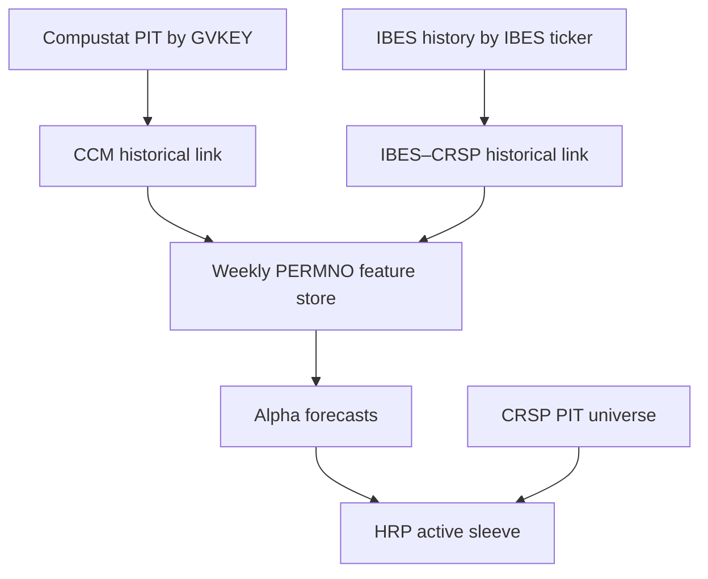

# AKMFOLIO

Research framework for long-only US equity portfolios built around
Hierarchical Risk Parity (HRP), a factor risk model, a multi-period cost-aware
optimizer (MPC) and a set of point-in-time alpha signals. The main model is
`retail_alpha_ml_mpc`; everything is evaluated walk-forward against equal
weight (and optionally an ETF such as URTH) with deflated-Sharpe and
Newey-West HAC tests.

> **Status (Sept 2026).** No configuration has beaten equal weight with
> statistical significance. The risk model and optimizer reduce volatility and
> drawdown; stock selection by the signals has not added value. Results and
> the reasoning behind each change are logged in the claude.ai project docs
> (`claude/*.md`). Treat every backtest here as in-sample.

## Layout

```text
AKMFOLIO/
├── akm_hrp/                      package
│   ├── allocators/               all models (retail_alpha_ml_mpc.py is the main one)
│   ├── signals/                  structural alpha signals, HRP orthogonalisation, HMM regimes
│   ├── data/                     loaders, WRDS/CRSP builders, microstructure features, ETF benchmarks
│   ├── cov/ hrp/ overlay/        covariance estimators, HRP trees/allocation, bounds
│   ├── backtest/                 walk-forward engine and CPCV
│   ├── diagnostics/              dashboards, robustness report, significance tests
│   └── cli/                      compare_models and the data-build commands
├── data/                         inputs (git-ignored, see below)
├── runs/                         one folder per backtest run (git-ignored)
├── outputs/overfitting_diagnostics/   results of run_overfitting_diagnostics.py
├── experiments/                  one-off research scripts
├── tests/                        pytest suite
├── artikler/                     papers
├── run_full_scale_retail_alpha_ml_mpc_fixed.sh   main launcher (13-week)
├── run_52w.sh                    same model, annual rebalancing
├── allmodels.sh                  every registered model, 13-week
├── run_overfitting_diagnostics.py                CPCV / placebo / bootstrap battery
└── fetch_yfinance_extension.py   extends the WRDS data past 2025-12-26
```

## Data (`data/`)

| file | content |
|---|---|
| `weekly_returns.csv` | weekly (Friday) total returns, PERMNO columns, 1990-01 → 2026-08 (WRDS CRSP CIZ to 2025-12-26, Yahoo Finance after) |
| `pit_universe.csv` | point-in-time eligibility mask (top ~2,500 by market cap; 2026 rows forward-filled) |
| `balanced_hrp/` | sector-balanced core universe (`pit_universe.csv`, `weekly_returns.csv`, style factors); ends 2025-12-26 |
| `structural_features.csv`, `structural_alpha_features.csv.gz` | lagged market cap, liquidity, volatility features |
| `compustat_pit_features_long.csv.gz` | release-aware Compustat fundamentals (value, quality, earnings surprise) |
| `microstructure_alpha_features.csv.gz` | weekly closing-auction / order-flow features from daily OHLC, 1992-07 → 2026-01-02 |
| `sector_history.csv`, `crsp_sector_history.csv.gz` | point-in-time sector classification |
| `crsp_security_metadata.csv` | PERMNO → ticker lookup |
| `crsp_treasury_weekly_returns.csv` | 5-year Treasury index returns in percent (macro input to the regime model) |
| `benchmarks/URTH_weekly_returns.csv` | cached ETF benchmark returns |
| `daily_cache/` | cached WRDS daily chunks |

Known data issues:
- `balanced_hrp/pit_universe.csv` drops from ~174 to ~52 names on 2023-10-06 and stays there; the
  underlying returns and features do not, so the file should be rebuilt.
- 2026 returns come from Yahoo Finance and the 2026 universe is a copy of the 2025-12-26 row.
- Microstructure features end 2026-01-02; those signals switch off after that date.

## Running a backtest

Run from the repo root with the Portfolio virtual environment (the launchers
use `/Users/anderskinch/Portfolio/.venv/bin/python`, override with `PYTHON=`).
Each run writes `runs/<name>_<timestamp>/` with `results.csv`,
`diagnostics.csv`, `robustness/`, `latest_weights.csv`, yearly dashboards and
`run.log`.

```bash
./run_full_scale_retail_alpha_ml_mpc_fixed.sh                          # baseline
./run_full_scale_retail_alpha_ml_mpc_fixed.sh --structural-signals all  # + structural signals
./run_full_scale_retail_alpha_ml_mpc_fixed.sh --retail-alpha-ml-selection core \
    --models equal_weight retail_alpha_ml_mpc retail_alpha_ml_mpc_equal_weight
```

The main launcher: 13-week rebalancing, 60-name budget, 1% weight floor,
turnover cap 2.0 per rebalance, fundamentals on, evaluation from 2005-01-05,
equal weight as significance benchmark, URTH as extra benchmark. Extra
arguments are passed straight to `compare_models` and override the defaults.
`BUDGET`, `DATA_START` and `RUN_DIR` can be set in the environment.

Useful `compare_models` flags (see `python -m akm_hrp.cli.compare_models --help`):

| flag | effect |
|---|---|
| `--models ...` | which models to run (`equal_weight`, `retail_alpha_ml_mpc`, `retail_alpha_ml_mpc_equal_weight`, `retail_alpha_ml_mpc_crowding`, `retail_alpha_mpc`, `dynamic_barra_alpha`, `ra_hrp_v2`, `hrp_alpha_v2`, …) |
| `--rebalance-every-weeks N` | rebalance cadence |
| `--max-rebalance-turnover X` | per-rebalance L1 turnover cap; must be raised (e.g. 2.0) at slow cadences or the book freezes |
| `--retail-alpha-ml-selection signal\|core` | `signal`: hold the top-N names by signal score; `core`: hold the whole balanced core, signals only size positions |
| `--retail-alpha-ml-max-total-assets N`, `--retail-alpha-ml-min-weight`, `--retail-alpha-ml-max-weight` | book size, weight floor, per-name cap (default 3%; `1.0` removes it) |
| `--structural-signals ...` | add structural signals (below), or `all` |
| `--external-benchmarks URTH` | add buy-and-hold ETF benchmarks (fetched once with yfinance, cached in `data/benchmarks/`) |
| `--evaluation-start`, `--data-start`, `--as-of` | scoring window, warm-up start, last date |
| `--deflated-sharpe-trials K` | number of configurations tried; set it honestly |
| `--retail-alpha-ml-allow-exposure-limit-relaxation`, `--retail-alpha-ml-allow-cvar-floor-relaxation` | let infeasible sector/style or CVaR limits widen instead of failing (logged in diagnostics) |

Note: the ML memory settings (`--retail-alpha-ml-fast-halflife`, `-slow-halflife`,
`-retrain-every`, `-ic-halflife`) are counted in rebalances, not weeks, so they
change meaning with the cadence.

## The model: `retail_alpha_ml_mpc`

1. **Universe.** Balanced core (sector-balanced, large and liquid) plus up to 30 admitted candidates from the broad universe.
2. **Signals** (each rank-normalised and market/industry-neutralised; weights learned online from rank ICs shrunk toward priors, negative-IC signals get zero weight):
   - economic: `momentum_12_1`, `post_earnings_drift`, `quality_value_carry`, `liquid_reversal`, `retail_agility`
   - tilts: `microcap_tilt`, `carry_quality_tilt` (no data: `shareholder_carry` is empty), `robust_fundamental_carry`
   - `ml_interaction_ensemble`: two gradient-boosted models + ridge, consensus-gated
   - optional structural signals (below)
3. **Selection.** Top `max_total_assets` names by composite score (or the whole core with `--retail-alpha-ml-selection core`).
4. **Risk model.** Factor model with predictive specific risk and DCC-style residual correlation.
5. **Optimizer.** Three-step receding-horizon MPC with spread and temporary/permanent impact costs, ADV participation, sector (25%), style (±0.25), CVaR and position limits; post-solve 1% weight floor.

### Structural signals (`--structural-signals`)

All are rank-normalised, residualised on `[1, shrunk beta, HRP correlation-cluster dummies, industry (+ styles)]`,
de-meaned and scaled to unit variance (`akm_hrp/signals/hrp_orthogonal.py`), so they cannot simply
re-weight a cluster the HRP tree already sizes. The checks `structural__*_cluster_r2_clean` and
`structural__*_beta_corr_clean` in `diagnostics.csv` should be ~0.

| name | idea | input |
|---|---|---|
| `moc_dislocation_reversal` | close vs VWAP-proxy dislocation, weighted by abnormal volume and index-rebalance days; reversal bet. ~1-week horizon: close to useless at 13-week rebalancing | microstructure file |
| `microstructure_regime_ml` | gradient-boosted trees on order-flow, spread and volume features × HMM stress probability; trained on beta/cluster-neutral returns | microstructure file |
| `regime_conditional_momentum` | momentum and reversal weighted by per-regime ICs from a Gaussian HMM; momentum off in bear + stress | returns, Treasury file |
| `betting_against_beta` | minus Frazzini-Pedersen shrunk beta; cluster/industry-neutral but deliberately not beta-neutral | returns |

## Rebuilding data

```bash
# WRDS CRSP CIZ weekly returns + PIT mask
python -m akm_hrp.cli.build_wrds_dataset --start 1990-01-01 --end 2025-12-26 --output-dir wrds_rebuild --top-n 2500   # then compare and copy into data/
# sector history, Treasury sleeve, structural features
python -m akm_hrp.cli.build_crsp_sector_history --start 1990-01-01 --end 2025-12-26 --output data/crsp_sector_history.csv.gz
python -m akm_hrp.cli.build_crsp_treasury_sleeves --start 1990-01-01 --end 2025-12-26 --output data/crsp_treasury_weekly_returns.csv
python -m akm_hrp.cli.build_structural_alpha_features --daily-cache-dir data/daily_cache --start 1990-01-01 --end 2025-12-26 --output data/structural_alpha_features.csv.gz
# Compustat fundamentals (needs the raw quarterly extract)
python -m akm_hrp.cli.build_compustat_pit_features --help
# balanced core universe
python -m akm_hrp.cli.build_crsp_balanced_universe --help
# microstructure features (daily OHLC, resumable cache)
python -m akm_hrp.cli.build_microstructure_features --download --start 1989-01-01 --end 2026-08-31 --cache-dir data/daily_ohlc_cache
python -m akm_hrp.cli.build_microstructure_features --cache-dir data/daily_ohlc_cache --universe data/weekly_returns.csv --output data/microstructure_alpha_features.csv.gz
# 2026 extension from Yahoo Finance (run in a normal terminal)
python3 fetch_yfinance_extension.py
# ETF benchmark cache
python -m akm_hrp.data.external_benchmarks URTH
```

Check each builder's `--help` for the exact inputs; the paths above follow the current `data/` layout.

## Tests and diagnostics

```bash
python -m pytest -q
python run_overfitting_diagnostics.py --help    # CPCV, placebo, Kelly-buffer, bootstrap checks
```

## How to read results

A higher Sharpe than equal weight is not evidence of alpha. Check, in `results.csv`:
`equal_weight_alpha_hac_t_stat` (needs > 1.645 one-sided), `deflated_sharpe_p_value`
with an honest `--deflated-sharpe-trials`, and whether `equal_weight` is identical across
runs you compare (otherwise the comparison is confounded). Every configuration tried on
2005–2026 counts as a trial; only data after a configuration is frozen is out of sample.

## Research notes (personal)

Factor risk decomposition + DCC-style residual correlation (retail_alpha_mpc.py) — this is a scaled-down Barra
Bayesian IC-shrinkage for signal weighting, decaying realized ICs toward priors rather than trusting raw backtest Sharpe — exactly how real multi-signal books size conviction
Walk-forward-validated ML with weight scaled by out-of-sample IC (hrp_alpha_v2.py) — most retail quant code skips this and just overfits in-sample
Explicit execution-cost modeling (spread + temporary + permanent impact) baked into the optimizer, not bolted on after
Regime-adaptive clustering (ra_hrp_v2_allocator.py's stability-spike gating) — this is a genuinely sophisticated idea most public HRP implementations don't have

1. Alle modeller er priset ind i market (MVO, MVP, HRP, CAPM, ..... )
2. Ingen faktor signaler generer alpha (ikke nok til at dœkke omkostninger)
3. Hvis du får gode resultater er det pga. overfitting og støj fra estimater.

Hvis modellen ska holde, skal man efter at have skrevet den for første gang (på data man ikke kender) kunne se at forskellen mellem ens benchmark og modellen er signifikant ifht. HAC t statistikkens ensidet test. Man vil afvise nulhypotesen som siger at modellen ikke afviger fra benchmarket signifikant.  

### Idéer og principper


#### Factor model 

Små ting der kan give en lillle lillle fordel !

kort... reel mulighed for alpha, da vi lettere kan reallokere i stedet for at sœlge og derfor betale skal eller betale mere i omkostninger hvis vi vil købe og sœlge for at udligne.
Kort kan give høj negativ korreleret asset. 
Men det er ikke gratis. og alle fees skal huskes at medregnes.
kunne give en kant ved at short høje beta aktier (mindre rente) og lange lave beta.


inspo [text](artikler/ssrn_id1020543_code623849.pdf)
anomly inspo [text](<artikler/houxuezhang2020rfs (1).pdf>)
factor inspo [text](artikler/ssrn-4695086.pdf)
[text](artikler/1-s2.0-S2405844020303613-main.pdf)
[text](artikler/ssrn-2319861.pdf)
[text](artikler/w20984.pdf)
[text](artikler/ssrn-2499205.pdf)  delta small large eu caps
tilt towards f-13filings largest buys rentec, jane street, kengriffin, millium, de shaw, agq, bridgewater. 

Hvis vi skal generere alpha skal det komme fra factor modellen. Der er kendte faktorer der giver lille alpha, så vi kan altid lave et fall back på sådan en. (momentum/low beta).

Vi mister også hurtigt det hele igen, hvis vi introducerer for meget støj i hvores covariance matrix. Derfor vil vi gerne holde factor modellen relavtiv simple og lave statistisk test på error estimation af more matrix. 
Få indsigt i problemet her [text](artikler/1-s2.0-S2405918826000048-main.pdf)
                            [text](artikler/2507.01918v3.pdf)
#### VI BRUGER Advanced AR-HRP (RMT + OLO) 

Vil kigge i kroge hvor de store funde har sin begrœnsninger.  (ingen gearing, stor position i mag7 for at nå benchmark, ingen mikro caps under 300M$ og at jeg ikke automatisk skal købe aktier der bliver tilføjet indexe, kan måske gøre det inden, hvis jeg får en god ide. 

vil også lave en vurdering af de vorskellige aktiers valuta og om den er god eller dårlig, baseret på carry trades og derefter tilt lidt i en retning.

vil også undersøge kort om det bliver mening at gå lang mikro caps og kort bluechip og hvilken risiko det skaber. 

stat arb skal vœre en del at modellen, hvis jeg ikke selv kan finde på noget finder jeg en aqr fund.

btc lang minus guld. lidt risky, men måske en ide. (måske ikke lige guld, men en asset der bliver udvandet kontinuerligt ligsom guld, som er modsat btc)

vi bruger ra-hrp model til at finde vœgte 

vil vi ender med lav beta og ønsker at opjusterer gør vi det gennem billige gearet spy future pga. fractuanally kelly crit. 


Få disse data ned i en fil der hedder weekly_returns.csv og har det rigtige format. GL.

Påstår ikke at kunne slå market (s&p) men med en hvis sandsynlighed slå det på et risk/return basis. Derfor hvis du vil slå skal du på en måde geare ved at få fat i billige lån i DK som er den edge som skal udnyttes. (krœver man har en vis startskapital)


Få et godt overblik over alpha: (close must read)
[text](artikler/w28432.appendix.pdf)

Lœs alt research fra DE Shaw og AQR og (bridge water)
de eneste top funds der ikke er helt stille.

#### AR_HRP

Vores model baserer sig hovedsagligt på HRP (SHUR-HRP)
[text](artikler/ssrn-53706246.pdf)
[text](artikler/2606.12612v1.pdf)
[text](artikler/ssrn-4623991.pdf)
rene beviser kan man bare tage for gode vare. 

#### MACHINE LEARNING

Når vi konstruerer en model skal vi altid teste i hoved og røv. F.eks. hvis jeg ville implementerer en ny ting ville jeg nok opstille nogle H_0 hypoteser, så man tilføjer en parameter på et stistics grundlag og hver kan man tilføjer, tilføjer man også støj til Covariancen. Så må man renge ud om det giver et højerer forventet afkast end hvad støjen fjerner af forventet afkast igen inden for et statistisk signifikant niveau (og det bliver meget uprœcist fordi det er notorisk svœrt at estimere afkast ), så der skulle nok vœre generelle højere krav for at acceptere sådan en parameter. 

#### OG NU DEN UMULIGE

UNDGå AL BAIS og OVERFITTING. Jeg tœnker, at hver kan jeg kører min model og retter noget, laver jeg selv en overfitting fordi jeg optimerer nogle parametre for at få et bedre resultat. Optimalt skrev vi opdellen og kørte den en gang for at se at den virkede. Du kan lade vœr med at udskrive noget fra din model, eller som alle andre køre out of sample tests over tilfœldige intervaller som du ikke kender når du er fœrdig.
Derudover skal den stresstestes under devires konstrueret (monte carlo) eller tidligere markedets crasheds og 

#### BACKTEST
[text](artikler/ssrn-2460551.pdf)

brug bootstrap og monte carlo
[text](artikler/ssrn-7333578.pdf)


Og her er den generelle struktur på vores model:

1.set contraints:
    Både max assets og max/min weights. (min(min.weights))=100/max.Nassets

2. Covariance matrix:
implement    (maybe Classic Barra-style with EWMA factor covariance, structural shrinkage on specific risk)

            Implement predictive specific-risk model (highest leverage) 
        WMA + Shrinkage + Residual DCC-GARCH:Factor Covariance ($\Omega_{f,t}$): Modeled using exponentially weighted moving averages (EWMA) blended with Ledoit-Wolf shrinkage to ensure positive semi-definiteness and numerical stability.Residual Covariance ($\Sigma_{\epsilon,t}$): Idiosyncratic returns are stripped of systematic factor exposure via WLS/OLS. The remaining residual correlation matrix is modeled using a Multi-Asset DCC process to capture time-varying, dynamic cross-asset residual tail risk.Predictive Specific Risk ($\hat{\sigma}_{i, \epsilon, t+1}^2$):Uses a multi-horizon autoregressive predictive structure (Daily, Weekly, Monthly components ala HAR-GARCH) to forecast future idiosyncratic variance per asset, incorporating dynamic volatility clustering.Multi-Scale Factor Volatility Dynamics:Adjusts factor returns dynamically across short-term ($5$d), medium-term ($21$d), and long-term ($63$d) lookback windows to capture regime shifts and multi-horizon volatility spillover. with these factor signals

            . factor model:
   
   1. robust fundamental investment signal (good carry)

    2. quality-decomposed skewness signal (good vs. bad carry filter)

    3. small-minus-big cap

    4. winsorize → rank→normal → neutralize → combine → grinold → rank-ic)5

    5. higher-moment tilted multi-factor allocation
        instead of simple equal-weighting across factors, apply the vsk tilting optimization from boudt et al. (2020) to ar-hrp.

    7. implement transaction ost Temporary + Permanent impact

    8. implement tail risk with Parametric CVaR only

    Clean Rank-Normalization: Cross-sectional percentile ranking mapped onto a standard Gaussian distribution $N(0, 1)$ with tail winsorization to remove outliers while preserving monotonic relative ordering.Multi-Factor Neutralization: Weighted Least Squares (WLS) regression against risk exposures (e.g., Sector, Market Beta, Size) to extract pure residual signal streams.Dynamic IC Estimation: Rolling Information Coefficient (IC) tracking using rank correlation (Spearman) adjusted for signal persistence and volatility.Grinold Fundamental Law Alpha Combination: Combining factors using dynamic IC weights scaled by residual volatility ($\sigma_\epsilon$) via Grinold's Fundamental Law of Active Management:$$\alpha_i = \text{IC}_i \times \text{Score}_{i, \text{neut}} \times \sigma_{\epsilon, i}$$


